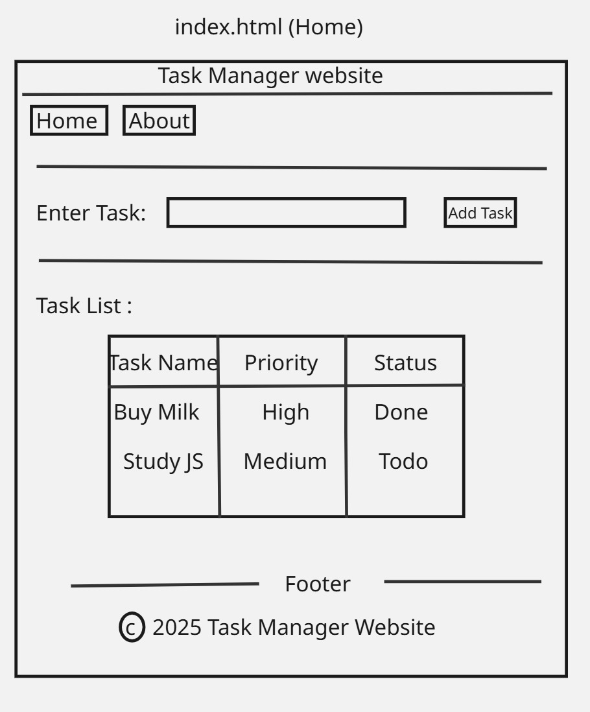
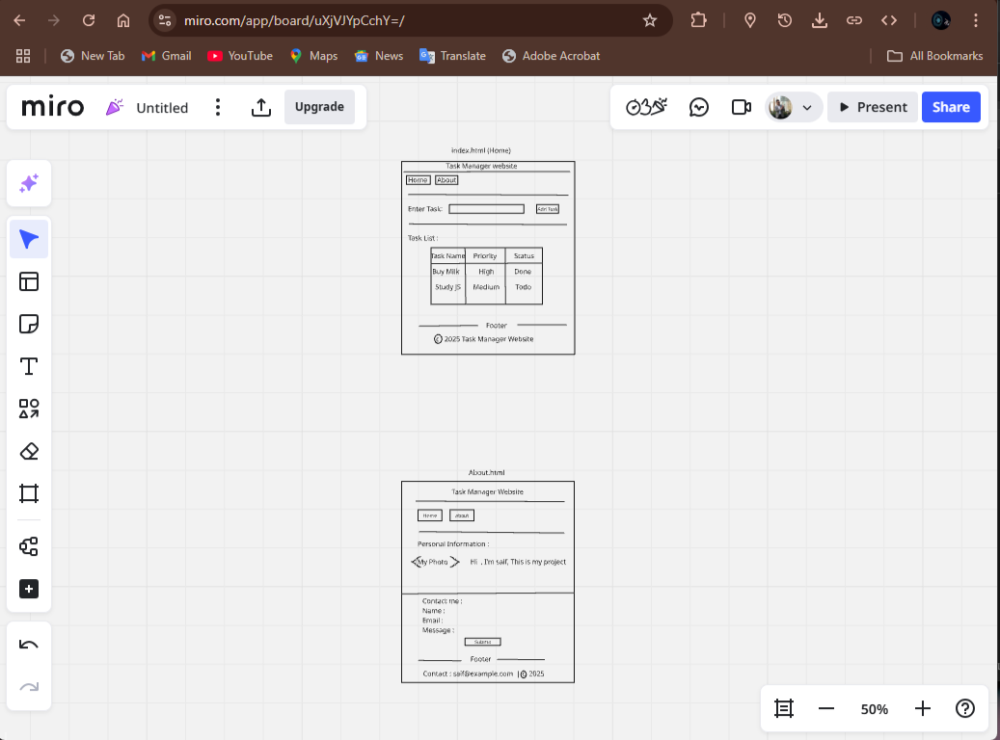

# My Tasks - Task Manager Website

## Overview

A simple web project to create a Task Manager using HTML, CSS, and JavaScript.

## Wireframes

## 

## 

## Questions:

- What observations or questions do you have about what you’ve learned so far?

1. I learned how to create HTML Strucutre.
2. I learned how to create CSS styles and link them to the HTML.
3. I learend how to deal with DOM and DOM manipulation.

- How long did it take you to complete this assignment? How long did you expect it to take?
  It takes from me about 1 hour, the expected time was 2 hour.

## Project Setup

- Created a branch: `task-html`
- Created index.html and about.html
- Implemented the task list and form
